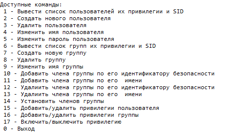

# Windows-user-security-settings
User security settings in Windows

Программа позволяет просматривать и редактировать настройки безопасности пользователей и групп в системе:

Программа может выводить списки зарегистрированных в системе пользователей и групп, их SID и привилегии; 
Программа может позволить добавлять/изменять/удалять пользователей и группы в ОС, а также удалять и добавлять, включать и выключать им привилегии; 

Для взаимодействия с системой используются функции WinAPI, которые вызываются с помощью динамической подгрузки из библиотек Advapi32.dll и Netapi32.dll.

Примеры работы некоторых функций программы:

Создание пользователя

Удаление пользователя

Добавление привилегии пользователя

Удаление привилегии пользователя

